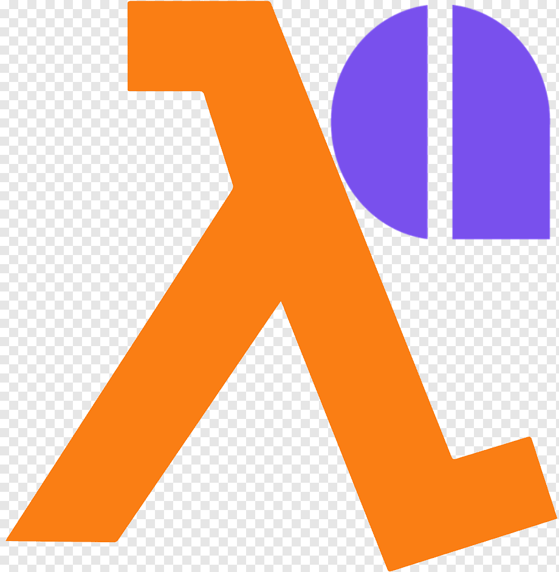
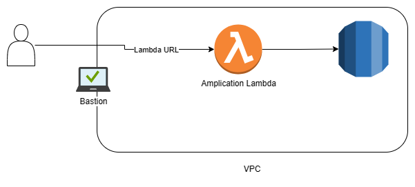

<!-- PROJECT LOGO -->
 

    

<h3 align="center">Amplification + AWS Lambda Adapter</h3>

  

    <a href="https://github.com/awslabs/aws-lambda-web-adapter">AWS Lambda Adapter</a> is the best kept secret that you can use in order to migrate non-lambda native application to the Lambda world. 
    The following repo shows an example of using a Nest based application created with <a href="https://amplication.com">Amplication</a> which is connected to a RDS database and exposed
    to the outside world using Lambda URL and a Lambda Web Adapter.
     
     
    <a href="https://github.com/aws-hebrew-book/web-adapter-example/issues">Report Bug</a>
    ·
    <a href="https://github.com/aws-hebrew-book/web-adapter-example/issues">Request Feature</a>
  

<!-- TABLE OF CONTENTS -->

  
Table of Contents

  <ol>
    <li>
      <a href="#high-level-architecture">High level architecture</a>
    </li>
    <li>
      <a href="#getting-started">Getting Started</a>
      <ul>
        <li><a href="#prerequisites">Prerequisites</a></li>
        <li><a href="#installation">Installation</a></li>
        <li><a href="#testing">Testing</a></li>
      </ul>
    </li>
    <li><a href="#contributing">Contributing</a></li>
    <li><a href="#license">License</a></li>
    <li><a href="#contact">Contact</a></li>
    <li><a href="#logo">Logo</a></li>
  </ol>

## High level architecture

    

1. A NestJS application created with the Amplication development tool. 
2. The application runs inside a Lambda using a docker image created by Amplication.
3. The Lambda is connected to the outside world using Lambda URL functionality.
4. And it's located inside a private subnet with an access to an RDS database.

## Getting started
### Prerequisites
* Make sure your machine is ready to work with [AWS SAM](https://aws.amazon.com/serverless/sam/)

### Installation
* Clone this repository.
* Run `sam build` and then `sam deploy --guided`.
* Choose user name and password for the DB.
* Make sure you a key pair for the bastion station.
* The Lambda URL has no authentication on purpose, the authentication is being handled by NestJS.

### Testing
* Access the Lambda URL end point and append `/api`, for example `https://****.lambda-url.us-east-1.on.aws/api`. 
* Authorize using `admin` as user and password, and make a call.

## Landmarks
* Defining the extension to be part of your docker file - https://github.com/aws-hebrew-book/web-adapter-example/blob/f787c8c8689259132db70b48b817da16217a5b7b/server/Dockerfile#L28
* NestJS application runs on port 8080 - https://github.com/aws-hebrew-book/web-adapter-example/blob/f787c8c8689259132db70b48b817da16217a5b7b/server/template.yaml#L206
* Authentication handled by NestJS - https://github.com/aws-hebrew-book/web-adapter-example/blob/f787c8c8689259132db70b48b817da16217a5b7b/server/template.yaml#L210
* Initial DB migration - https://github.com/aws-hebrew-book/web-adapter-example/blob/f787c8c8689259132db70b48b817da16217a5b7b/server/template.yaml#L125
* Using secret manager to save credentials - https://github.com/aws-hebrew-book/web-adapter-example/blob/f787c8c8689259132db70b48b817da16217a5b7b/server/template.yaml#L164
* **Anti Pattern** Embedding the credentials as part of UserData, this solution is quick and dirty use SecretsManager - https://github.com/aws-hebrew-book/web-adapter-example/blob/f787c8c8689259132db70b48b817da16217a5b7b/server/template.yaml#L124

### Monitoring
Monitoring is done by using [Lumigo](https://platform.lumigo.io/auth/signup)

## Contributing

Contributions are what make the open source community such an amazing place to learn, inspire, and create. Any contributions you make are **greatly appreciated**.

If you have a suggestion that would make this better, please fork the repo and create a pull request. You can also simply open an issue with the tag "enhancement".
Don't forget to give the project a star! Thanks again!

1. Fork the Project
2. Create your Feature Branch (`git checkout -b feature/AmazingFeature`)
3. Commit your Changes (`git commit -m 'Add some AmazingFeature'`)
4. Push to the Branch (`git push origin feature/AmazingFeature`)
5. Open a Pull Request

<!-- LICENSE -->
## License

Distributed under the Apache License Version 2.0 License. See `LICENSE` for more information.

<!-- CONTACT -->
## Contact

Efi Merdler-Kravitz - [@TServerless](https://twitter.com/TServerless)

(<a href="#readme-top">back to top</a>)

